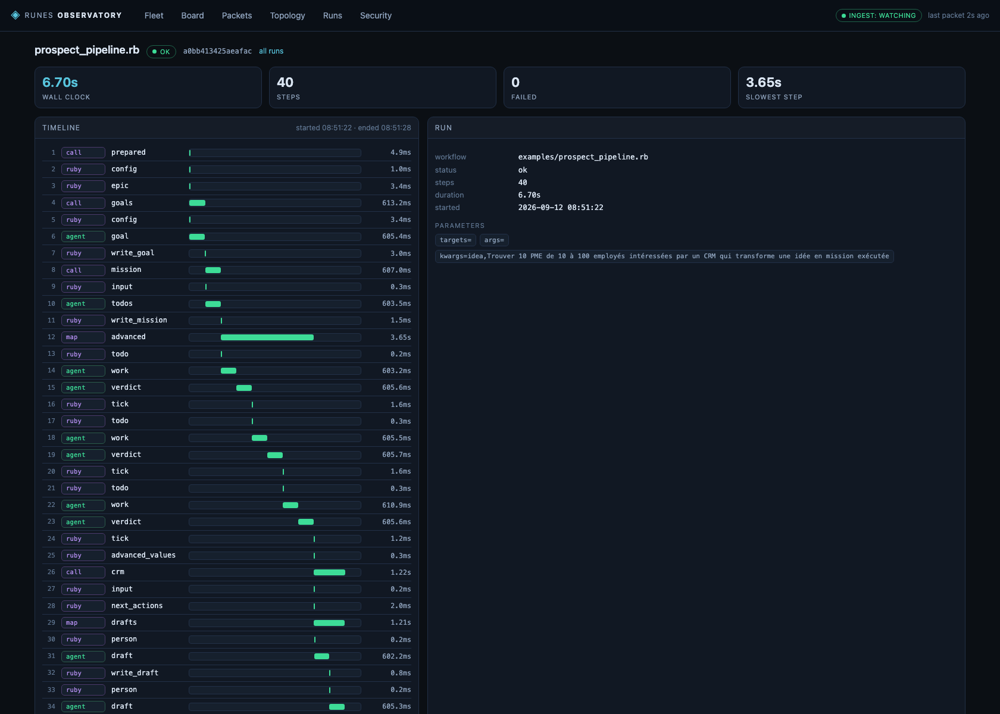

# Runes 🌀

RUNES: "RUby harNESs" for agentic tool coordination, riding on a
**pluggable messaging fabric**. LLM planners decompose intents into tool
calls; trusted host tools execute them inside a confined workspace; default
`ruby.wasm` sandboxes run untrusted tool code. Interactive modes shape an
idea into an **Epic**, refine it into a **Mission** (an ordered todo list),
then **build** it — one verified todo at a time.

Runes is a **sandboxed, auditable agent-execution fabric for local-first
fleets**: the moat is fail-closed verification with evidence + resume, WASM
isolation and the observatory — not "another agent framework". The 5-page pitch PDF is
[`docs/WHY_RUNES.pdf`](docs/WHY_RUNES.pdf) (generated from the markdown it
describes, so the two cannot drift). The "why"
(what we are *not* competing on, the moat, honest risks) is
[`STRATEGY.md`](STRATEGY.md); the longer pitch — why this is fun to build
and why it matters — is [`docs/WHY_RUNES.md`](docs/WHY_RUNES.md).

> Status (2026-09-10): **0.3.0** — the transport-agnostic series. The MQTT
> fabric is now one adapter behind `Runes::Transport`
> (`inproc | mqtt311 | mqtt5`); the home-grown claim/lease protocol was
> **deleted** in favour of MQTT 5 shared subscriptions; agents speak
> A2A-over-MQTT discovery/tasks and MCP tools in both directions, with
> per-agent Ed25519 identity and a mosquitto ACL generator. The suite is
> **fully offline** — provider HTTP is exercised through an injected dup
> transport, never the network. A **Rails 8.1 observatory**
> (`runes_observer/`) gives the fleet and every MQTT packet a web UI. See
> `STATE.md` for the current suite count, `DEVELOPMENT_LOG.md` for the full
> history and `STRATEGY.md` for the positioning.

## 🏗️ Architecture

```
   TUI / CLI ──▶ runes/prompts ──▶ Dispatcher ──▶ LLM router (multi-provider)
                                        │
                                        ▼
                              mode: build | goal | plan | mission
                                        │
                        Planner / Chat ──▶ steps / todos / verdicts
                                        │
             ┌──────────────────────────┴──────────────────────────┐
             ▼                                                     ▼
      Guarded host tools                              WASM tool pool (opt-in)
      write_file read_file run_command                ruby.wasm via wasmtime
             │                                                     │
             └──────────────────────┬──────────────────────────────┘
                                    ▼
              Runes::Transport  (inproc | mqtt311 | mqtt5)
              MQTT 5 ── shared subscriptions + PUBLISH properties
                                    │
             ┌──────────────────────┼───────────────────────┐
             ▼                      ▼                       ▼
       runes/# fabric         $a2a/v1 discovery        MCP stdio
       prompts · progress     + tasks (Agent Cards)    bin/runes-mcp
       response · tasks                               (guarded builtin
       tools · journal                                + manifest tools)
```

## ✨ Features

- **Transport-agnostic fabric** — the dispatcher talks only to
  `Runes::Transport`: an **in-process hub** (tests, offline demos, embeds;
  native shared groups), an **MQTT 3.1.1** adapter (the classic `mqtt` gem,
  maximum compatibility) and a hand-rolled **MQTT 5** adapter (shared
  subscriptions + PUBLISH properties). `RUNES_TRANSPORT=auto` probes MQTT 5
  → 3.1.1 → inproc, so the bus is a choice, not a requirement. The seam
  itself needs no client library: `require "runes/transport"` always defines
  `Transport.build`, and the legacy `mqtt`-gem adapter is loaded on demand
  (a missing gem is a clear error, not a half-loaded module).
- **Embedded MQTT broker (dev convenience)** — QoS 0 inbound (QoS 1/2
  accepted with PUBACK/PUBREC; QoS 2 retransmissions de-duplicated),
  UNSUBSCRIBE, retained messages, Last Will & Testament, wildcards (`+`,
  `#`), in-process subscriber API, packet / connection / subscription caps,
  a retained count **and byte** budget, CONNECT required before any other
  packet, wildcard Will topics rejected, time-boxed body reads. Production
  points at mosquitto/EMQX.
- **Exactly-once work (MQTT 5 shared subscriptions)** — `runes/prompts` is
  consumed as `$share/runes-prompts/runes/prompts`, so the broker hands
  each prompt to exactly one member of the group. The old
  claim/lease/execution-announcement protocol was **deleted** in 0.3.0. On
  MQTT 3.1.1 (no `$share`) the agent refuses to pretend: it either fails
  (`RUNES_REQUIRE_SHARED_SUBSCRIPTIONS=1`) or runs as the fleet's **single
  consumer** with a loud warning. Prompts run on a fixed worker pool and
  are **never** executed on the transport's receive thread; a saturated
  queue answers `busy` instead. Execution itself is deduped:
  `Runes::RequestLedger` refuses to run the same `request_id` twice inside its
  TTL — a redelivered PUBLISH, a session replay or a publisher retry gets the
  first copy's outcome instead of a second run — across prompts, A2A tasks,
  delegations and direct tool RPCs.
- **A2A-over-MQTT** — each agent publishes a retained A2A Agent Card on
  `$a2a/v1/discovery/<org>/<unit>/<agent_id>` carrying an `a2a-status`
  user property; tasks arrive on `$a2a/v1/tasks/...` and are answered via
  Response Topic / Correlation Data. The legacy `runes/agents/<id>/card`
  is still published verbatim for the TUI and the observatory.
- **MCP, both directions** — `bin/runes-mcp` serves the harness's guarded
  builtin + manifest tools over stdio (no broker, database or WASM
  required), and `Runes::MCP::Client` spawns external MCP servers and
  lists/calls their tools through the provider seam.
- **Per-agent identity** — Ed25519 keypairs, canonical signed JSON
  envelopes verified before execution (`RUNES_REQUIRE_SIGNATURES=1`), a
  fail-closed trust store, and `bin/runes-acl` to generate a
  least-privilege mosquitto ACL file with no catch-all allow.
- **Agent Cards + LWT** — the retained card is published at boot; unclean
  disconnects flip the retained `…/status` from `online` to `offline`.
- **Streaming progress** — every request gets a `request_id`;
  `runes/prompts/<id>/progress` carries the full event stream.
- **Tool manifests** — drop a directory into `tools/` (card.json +
  capabilities.json + run.rb); it is registered, ACL-enforced, and
  executed inside the WASM sandbox without touching `lib/`.
- **Default-deny capability guard** — per-tool rules enforced on BOTH
  the direct-RPC path and the planner path (`fs_write` / `fs_read` /
  `exec` actions). Default-deny applies to unknown tools and actions; the
  three builtins (`write_file`, `read_file`, `run_command`) ship allow-all
  until `config/policy.json` narrows them, and the guard warns about that on
  every boot. A policy file that exists but cannot be parsed now fails
  **closed** rather than quietly leaving the builtin baseline in place.
- **Function-calling planner** — OpenAI-style `tools` schemas +
  structured `tool_calls` (the default; opt out via `RUNES_USE_TOOLS=0`
  to restore free-form JSON plans).
- **WASM sandbox (opt-in, validated)** — real `ruby.wasm` boot with
  WASI, code via stdin, 5B fuel budget; deterministic mock backend by
  default so demos run offline.
- **Interactive modes** — `/goal` → Epic, `/plan` → Mission,
  `/build <mission>` → sequential verified execution with per-todo QA
  verification and crash resume. See below.
- **Durable journal** — every prompt lifecycle (and mission step) is
  appended to `log/journal.jsonl` (10 MiB rotation to a timestamped
  archive, under a cross-process `flock`) and published on
  the bus; `bin/runes-replay` shows or replays it.
- **Tool RPC is opt-in and authenticated** — the
  `runes/tools/<t>/request` execution topic is off unless
  `RUNES_TOOL_RPC=1`, and every request must carry the shared
  `RUNES_RPC_SECRET` (constant-time compare). Planner-driven tools are
  unaffected.
- **Confined shell** — `run_command` rejects any path token that leaves
  the workspace (`..`, absolute paths, `~`) before execution, in addition
  to the metacharacter/destructive-verb filters.
- **Runes (Roast-compatible workflows)** — a declarative workflow DSL
  whose seven verbs (`cmd`, `ruby`, `chat`, `agent`, `map`, `repeat`,
  `call`) are ordinary plugins. An unmodified [Shopify
  Roast](https://github.com/shopify/roast) `.rb` file runs as-is; see
  [Runes](#-runes-roast-compatible-workflows).

## 🚀 Quick Start

```bash
bundle install
cp config/.env.example config/.env
# edit config/.env — set DEEPSEEK (preferred: V4.1 Flash, model
# `deepseek-flash`, variation high) and/or SYNTHETIC / CEREBRAS_API_KEY.
# With several keys present the order is DeepSeek > Synthetic > Cerebras.

# 1) offline smoke test (embedded broker, stub planner — no API key)
bundle exec ruby demo/smoke.rb

# 2) live end-to-end demos (real LLM)
bundle exec ruby demo/hello_world_live.rb     # build mode, hello world + minitest
bundle exec ruby demo/modes_live.rb           # /goal → epic → /plan → mission
bundle exec ruby demo/build_mission_live.rb   # /build: plan→execute→QA-verify

# 3) interactive use (multi-agent fleets: RUNES_TRANSPORT=mqtt5, mosquitto 2.x)
mosquitto -p 1883 &                 # or: bundle exec ruby demo/broker.rb 1883
RUNES_TRANSPORT=mqtt5 ./bin/runes-daemon &   # shared-subscription agent
./bin/runes                         # the TUI ( Registry | Traffic | Input )
./bin/runes-client --agents         # who is listening, and where they write
./bin/runes-client "prompt"         # one-shot CLI prompt

# 4) interop + broker access control
./bin/runes-mcp                     # MCP server: guarded tools over stdio
./bin/runes-acl --agent runes-a     # print a fail-closed mosquitto acl_file

# 5) declarative workflows (Roast DSL)
./bin/runes-workflow execute examples/analyze_codebase.rb      # every step
./bin/runes-workflow execute examples/analyze_codebase.rb chat_summary
./bin/runes-workflow --quiet execute examples/analyze_codebase.rb  # no output
```

## 🏭 A real pipeline, as a workflow

`examples/prospect_pipeline.rb` (431 lines) is the whole engine of a
CRM/product pipeline in one readable file: idea → `goal.md` → mission `.mmd`
kanban → every todo executed and verified → next action per contact → drafted
(never sent) outreach → weekly report. It writes the Mermaid kanban format
[`pipeline_prospect`](docs/EXAMPLE_CRM_PIPELINE.md) already publishes, so the
same file is readable by a human, an agent and that Rails app. This is the
"we did not build you a SaaS, we built the engine you can tweak in one line"
argument, in code — with its boundaries written down.



*That is the run above, as the Rails app saw it: 40 steps, 6.70 s wall clock,
0 failed, 3.65 s in its slowest step (the `map` over todos), every step's
duration on a shared track, and the parameters it was given. Recorded by
`bin/runes-ingest`, drawn from the workflow's own telemetry — and reproducible
with `scripts/demo_pipeline_run.rb` + `scripts/screenshot_observatory.sh`.*

Then read [`docs/DSL_POWER.md`](docs/DSL_POWER.md)
([PDF](docs/DSL_POWER.pdf)): the whole DSL on one page, the pipeline scope by
scope, the three sharp edges worth knowing before you find them, and why the
loop is fun. [`docs/WHY_RUNES.md`](docs/WHY_RUNES.md)
([PDF](docs/WHY_RUNES.pdf)) is the why; the DSL guide is the how it feels.

## 🧩 Runes (Roast-compatible workflows)

Runes can run [Shopify Roast](https://github.com/shopify/roast) workflows
unmodified. This is Roast's own README example — the `execute` block
below is byte-for-byte what Roast ships (the file in `examples/` adds only
a comment header):

```ruby
# examples/analyze_codebase.rb
execute do
  # Get recent changes
  cmd(:recent_changes) { "git diff --name-only HEAD~5..HEAD" }

  # AI agent analyzes the code
  agent(:review) do
    files = cmd!(:recent_changes).lines
    <<~PROMPT
      Review these recently changed files for potential issues:
      #{files.join("\n")}

      Focus on security, performance, and maintainability.
    PROMPT
  end

  # Summarize for stakeholders
  chat(:summary) do
    "Summarize this for non-technical stakeholders:\n\n#{agent!(:review).response}"
  end
end
```

```bash
./bin/runes-workflow execute examples/analyze_codebase.rb              # all steps
./bin/runes-workflow execute examples/analyze_codebase.rb chat_summary # one step
./bin/runes-workflow examples/analyze_codebase.rb -- env=staging      # workflow args
```

A workflow is a plain `.rb` file `instance_eval`'d against the workflow
object, so only three methods exist at the top level — `config`,
`execute(scope = nil, &block)` and `use`. Inside a step, `self` is the
step's *input context*, which is why `cmd!(:name)` is a method call and
not a variable. Each verb has Roast's accessor triple: `cmd(:x)`
declares, `cmd!(:x)` runs-and-returns, `cmd?(:x)` answers *has it
already run*.

### The seven runes

| Rune | Runs | You read from it |
| --- | --- | --- |
| `cmd` | a process (Roast's `CommandRunner`: argv, or a shell string) | `out`, `err`, `status`, `lines` |
| `ruby` | a block, with its value as the output | `value`, `[]`, `call`, `method_missing` |
| `chat` | one prompt against an LLM provider | `response`, `session` |
| `agent` | a coding agent CLI (pi/claude) with the prompt on stdin | `response`, `session`, `stats` |
| `map` | a step body once per item (threaded with `parallel`) | `iteration(i)`, `iteration?(i)`, `first`, `last` |
| `repeat` | a step body until `break!` / `max_iterations` | `value`, `iteration(i)`, `results` |
| `call` | a saved scope, as a subroutine | opaque — extract with `from(...)` |

`skip!`, `fail!`, `next!` and `break!` are the control-flow primitives;
`from`, `collect` and `reduce` are the combinators. `cmd` takes a command
String (as in the example above) or an argv Array (`["git", "diff"]`); a
Hash is not part of the surface and is rejected with a message that says
so. Step bodies declare their input by returning it, and configuration is
scoped with `config do cmd(:name) { … } end` or a `/regexp/` — merged in
Roast's precedence order (global → general → regexp → name).

### Each rune is a plugin

The verbs above are not special-cased in the engine. Each is a
`Runes::Plugin` of kind `:rune`, which is the same registry the rest of
the harness uses:

```ruby
class Runes::Plugins::Cmd < Runes::Rune
  plugin :cmd, description: "Run a process and capture its output"
end

Runes::Plugin.names(kind: :rune)
# => [:agent, :call, :chat, :cmd, :map, :repeat, :ruby]
```

That has two consequences worth spelling out. A third party can add a
verb by dropping in a class — no engine change — and because a rune is a
plugin rather than a special case, it is addressable by every mechanism
the harness has for plugins (journalling, replay, the observatory). It is
*not* yet reached by the capability guard — see the known gap in
`STATE.md`, and `docs/WORKFLOWS.md` § "Not yet done: the guard does not see
runes". See
[docs/WORKFLOWS.md](docs/WORKFLOWS.md) for the contract, the
matched-vs-deviations tables, and the two places Runes deliberately
differs: `parallel` uses threads instead of the `async` gem, and `chat`
reuses this harness's provider router instead of `ruby_llm`.


## 🎛️ Interactive modes (TUI)

Slash commands are parsed **locally in the TUI** and never published as
prompt text. The mode rides in the prompt envelope
(`{request_id, prompt, mode, session_id, …}`); absent/unknown mode →
`build`.

| Command | What it does |
|---|---|
| `/goal <text>` | Opens a **goal session** — a rubber-duck + PM conversation (reflects back, asks 2–4 direction questions per turn, never writes code). Plain lines continue the session. |
| `/done` | Renders the conversation into an **Epic** at `docs/epics/<ts>-<slug>.md` (Problem / Target users / Goals / Non-goals / Success criteria / Constraints / Open questions) and closes the session. Invalid renders are rejected; the session stays open for retry. |
| `/plan [text]` | Turns a brief — or, with no text, the latest epic — into a **Mission** at `docs/missions/<ts>-<slug>.md` plus a `.json` sidecar: 3–9 ordered todos with detail + acceptance criteria. Invalid JSON → one re-ask → fail-loud (no garbage files). No text and no epic → the TUI opens goal mode. |
| `/build` | Switch back to build mode: plain prompts → LLM plan → guarded tools execute. |
| `/build <mission>` or `/build latest` | **Mission executor**: for each pending todo — plan it, execute it through the guarded tool pipeline, then a strict QA verifier judges the acceptance criteria against the recorded evidence. Passed todos are ticked in the sidecar (`done: true`) and the markdown (`- [x]`); the run stops at the first failure (re-run `/build` to resume — done todos are skipped) unless `RUNES_MISSION_CONTINUE=1`. |
| `/agents`, `/help` | Fleet visibility / command reference. |

TUI footer shows the mode chip (`[ build ]`, `[ goal s-xxxx ]`). Mission
progress (`mission_started / step_start / step_done / step_failed /
mission_complete / mission_failed`) streams into the Traffic panel.

Non-TUI clients: `./bin/runes-client --mode goal|plan "…"`,
`--agents` (list agents + workspaces), `--agent <id> "…"` (targeted
task via `runes/agents/<id>/tasks`).

### Design guarantees

- **Artifacts are host-written**: epic/mission paths are generated
  (timestamp + sanitized slug); client-supplied `epic_path` is
  containment-checked against `docs/epics/`; `mission_path` against
  `docs/missions/`. The LLM never controls paths.
- **Fail-closed QA**: the mission verifier passes only on stated
  evidence; planners are instructed to *produce* evidence (read back /
  run what they built). Anything else is a fail.
- **One winner, everywhere**: `runes/prompts` is consumed through the
  transport's *shared* subscription (`$share/runes-prompts/runes/prompts`
  on MQTT 5), so the broker delivers each build prompt and each goal/plan/
  mission turn to exactly one group member. A transport that cannot do
  shared groups (MQTT 3.1.1) says so loudly and either runs as the fleet's
  single consumer or refuses to start
  (`RUNES_REQUIRE_SHARED_SUBSCRIPTIONS=1`) — it never silently
  double-executes. Prompts run on a fixed worker pool; the transport's
  receive thread never executes one.
- **Sessions are in-memory** (LRU cap 32, history cap 40 messages,
  30 min idle TTL); the journal keeps the durable record.

## ⚙️ Configuration

| Env var                | Default                       | Purpose                                     |
|------------------------|-------------------------------|---------------------------------------------|
| `DEEPSEEK` / `DEEPSEEK_API_KEY` | —                  | DeepSeek API key (preferred; V4.1 Flash)     |
| `SYNTHETIC` / `SYNTHETIC_API_KEY` | —                   | Synthetic API key (GLM models)              |
| `CEREBRAS_API_KEY` / `CEREBRAS`   | —                   | Cerebras API key (optional)                 |
| `RUNES_DEFAULT_PROVIDER` | auto (first keyed provider) | `deepseek` > `synthetic` > `cerebras`       |
| `RUNES_DEFAULT_MODEL`  | provider default              | Model id or friendly alias                  |
| `RUNES_DEFAULT_VARIATION` | `high`                     | `high`/`balanced`/`low` (also `max`)        |
| `RUNES_LLM_ADAPTER`    | `builtin`                     | `ruby_llm` (or a registered adapter) instead of the built-in router |
| `RUNES_ROOT`           | `<project>/`                  | Redirect DB/journal/docs/tools (tests, embeds) |
| `RUNES_WORKSPACE`      | `<project>/workspace/`        | Where tools may read/write/run (deterministic — never the launch dir) |
| `RUNES_POLICY`         | `config/policy.json`          | System-wide capability policy               |
| `RUNES_WASM`           | `mock` (`real` to enable)     | ruby.wasm backend (honoured from `config/.env`) |
| `RUNES_MQTT_HOST/PORT` | `127.0.0.1` / `1883`          | Broker endpoint                             |
| `RUNES_TRANSPORT`      | `auto`                        | `auto`/`inproc`/`mqtt311`/`mqtt5` (auto probes 5 → 3.1.1 → inproc) |
| `RUNES_PROMPT_GROUP`   | `runes-prompts`               | MQTT 5 shared-subscription group for `runes/prompts` |
| `RUNES_REQUIRE_SHARED_SUBSCRIPTIONS` | unset (warn + solo) | `1` makes missing `$share` support fatal |
| `RUNES_A2A`            | on                            | `0` disables A2A discovery + task topics    |
| `RUNES_A2A_ORG` / `RUNES_A2A_UNIT` | `runes` / hostname | Segments of the `$a2a/v1/...` topic namespace |
| `RUNES_REQUIRE_SIGNATURES` | unset (**off**)           | `1` requires signed envelopes from trusted keys |
| `RUNES_TRUST_DIR`      | `<root>/config/trust`         | Trusted peer public keys (`*.pem`) for verification |
| `RUNES_TIMEOUT_S`      | `180`                         | CLI response timeout                        |
| `RUNES_LLM_TIMEOUT_S`  | `180`                         | Planner HTTP timeout (reasoning models are slow) |
| `RUNES_MAX_TOKENS`     | unset (provider default)      | Optional completion cap sent to the provider |
| `RUNES_USE_TOOLS`      | on                            | `0` opts out of function-calling (free-form JSON plans) |
| `RUNES_MAX_STEPS`      | `25`                          | Cap on planner steps per prompt             |
| `RUNES_MAX_CONCURRENT` | `4`                           | Prompt worker pool size (queue cap = 4×)    |
| `RUNES_TOOL_RPC`       | unset (**off**)               | `1` enables the `runes/tools/+/request` execution topic |
| `RUNES_RPC_SECRET`     | —                             | Shared secret every tool-RPC request must carry |
| `RUNES_CMD_ALLOWLIST`  | unset (denylist + path confinement) | Permitted command binaries (exclude interpreters!) |
| `RUNES_CMD_TIMEOUT_S`  | `10`                          | Per-command execution timeout               |
| `RUNES_CMD_OUTPUT_CAP` | `65536`                       | Max captured command output bytes           |
| `RUNES_READ_CAP`       | `1048576`                     | Max bytes returned by `read_file`           |
| `RUNES_WRITE_CAP`      | `1048576`                     | Max bytes accepted by `write_file`          |
| `RUNES_RETRY_BACKOFF_S`| `0.5`                         | Base LLM retry backoff (tests use `0`)      |
| `RUNES_SESSION_TTL_S`  | `1800`                        | Idle goal-session TTL                       |
| `RUNES_MISSION_CONTINUE` | unset (stop on failure)     | `1` keeps executing after a failed todo     |
| `RUNES_WASM_TIMEOUT_S` | `30`                          | Wall-clock limit per WASM guest run (epoch interruption) |
| `RUNES_REDACT_PROMPTS` | unset (full text)             | `1` redacts prompt content in the journal   |
| `RUNES_ALLOW_PROVIDER_FALLBACK` | on                   | `0` fails instead of routing to another keyed provider |

## 🤖 LLM provider router

All providers are OpenAI-compatible (`/chat/completions`); the registry
in `LLMClient::PROVIDERS` maps provider → endpoint, key env vars, model
aliases and how a "variation" is expressed:

| Provider    | Endpoint                              | Default model                    | "high" means             |
|-------------|---------------------------------------|----------------------------------|--------------------------|
| `deepseek`  | `https://api.deepseek.com/v1`         | `deepseek-flash` (V4.1 Flash)    | `reasoning_effort: high` |
| `synthetic` | `https://api.synthetic.new/openai/v1` | `syn:large:text` (GLM-5.3-Flash) | `reasoning_effort: high` |
| `cerebras`  | `https://api.cerebras.ai/v1`          | `llama-3.3-70b`                  | `temperature: 0.7`       |

**Preference order** (`LLMClient::PROVIDER_PREFERENCE`, also the fallback
chain and the fresh-DB seed order): **DeepSeek > Synthetic > Cerebras**.
If the DeepSeek key is present it is used; otherwise the first keyed
provider in that order. A stale `runes.db` that names a provider with no
key is migrated at boot (`Settings#reconcile_provider_preference`).

Resolution: call arg > `RUNES_DEFAULT_*` env > preferences DB
(`runes.db`) > provider default. A configured provider without a key
falls through to the next keyed provider in preference order (with a
notice). Aliases: `deepseek`/`v4.1-flash`/`deepseek-v4-flash`/
`deepseek-v4-pro` → `deepseek-flash`; `glm-5.3-flash` → `syn:large:text`,
`glm-4.7-flash` → `syn:small:text`; `deepseek*`/`syn:*` ids pass through.
`RUNES_MAX_TOKENS` (optional) caps completions; per-call `usage` and
`finish_reason` are surfaced to callers and journalled. DeepSeek V4.1
Flash runs with thinking enabled by default — we send the single-turn
`reasoning_effort` form, and mission rendering still uses variation `low`
(it is a format conversion; `high` on a full epic exceeded the timeout).

## 📡 MQTT Topic Map

```
runes/agents/<id>/card                  retained — legacy Agent Card (TUI/observatory)
runes/agents/<id>/status                retained — online|offline (LWT)
runes/agents/<id>/tasks                 addressed task envelope
runes/agents/<id>/tasks/<req>/response  correlated delegation reply
runes/prompts                           broadcast prompt (JSON envelope)
$share/<group>/runes/prompts            shared-subscription form agents consume
runes/prompts/<req>/progress            event stream (JSON per event)
runes/prompts/<req>/response            correlated reply
runes/prompts/response                  global fan-out summary
runes/_log/prompts                      journal feed (+ /latest retained)
runes/tools/<t>/request|response|error  direct tool RPC (opt-in)
runes/guard/denied                      capability refusal (tool, action, resource, agent)
$a2a/v1/discovery/<org>/<unit>/<agent>  retained A2A Agent Card (+ a2a-status property)
$a2a/v1/tasks/<org>/<unit>/<agent>      A2A task (answered via Response Topic/Correlation Data)
```

`claim` / `started` topics are gone with the claim protocol. Note that
MQTT wildcards never match `$`-prefixed topics: an observer must subscribe
to `$a2a/v1/...` (or `$a2a/#`) separately from `runes/#`.

`runes/guard/denied` is the one topic that carries a **refusal**: the
dispatcher attaches a `Runes::GuardTelemetry` sink to its transport, so every
capability denial (`{tool, action, resource, agent, phase, at}`) is published
where the observatory can count it — refusals are the security-relevant half of
what a fleet does, and they used to exist only as a log line. Publishing is
rate-capped (`Runes::GuardTelemetry::MAX_PER_MINUTE`), and
`bin/runes-workflow` reports `RUNES_WORKFLOW_POLICY` refusals on the same topic
whenever `RUNES_TELEMETRY` is set.

Progress events: `prompt_received`, `plan_ready`, `plan_truncated`,
`prompt_truncated`, `step_start`, `step_end`, `prompt_complete`,
`conversation`, `epic_written`, `mission_planning`, `mission_written`,
`mission_started`, `mission_step_start`, `mission_step_tool`,
`mission_step_done`, `mission_step_failed`, `mission_complete`,
`mission_failed`, `planner_error`, `epic_invalid`, `epic_write_failed`,
`mission_write_failed`, `mission_invalid`, `plan_empty`.

## 🔒 Security model

- **Workspace confinement**: `safe_path` rejects absolute paths, `..`
  escapes, and symlink escapes (realpath-of-deepest-ancestor check).
- **Command containment**: `run_command` rejects every path token that
  leaves the workspace (`..`, absolute paths, `~`) *before* execution,
  on top of the metacharacter blocklist (`$()`, `${}`, backticks, `;`,
  `|`, `<`, `>`, newline, NULL), the destructive-verb patterns, a
  per-command timeout with **process-group kill** (no orphans), an output
  cap and an optional binary allowlist. `chdir` is not treated as
  confinement.
- **Tool RPC is opt-in and secret-gated**: with `RUNES_TOOL_RPC` unset
  (the default) the dispatcher does not even subscribe to
  `runes/tools/+/request`. When enabled, every request must carry the
  `RUNES_RPC_SECRET` token (constant-time compare) or it is refused on
  the tool's `error` topic. Planner-driven tools are unaffected.
- **Guard on both paths**: planner-driven tools and direct RPCs both go
  through the capability guard, which is asked about the *resolved*
  workspace-relative path rather than the raw planner string; baseline
  grants live in the Guard and are overridable by `config/policy.json` or
  per-tool manifests.
- **Fail-closed QA**: the mission verifier judges bounded but *raw* tool
  evidence (8 KiB per todo, explicitly marked when truncated) and fails
  closed on anything ambiguous.
- **Signed envelopes (opt-in)**: with `RUNES_REQUIRE_SIGNATURES=1` every
  inbound envelope must verify against a key in `RUNES_TRUST_DIR`
  (Ed25519 over the canonical payload); missing / unknown / bad signatures
  are refused and answered *before* the planner sees them. Signing covers
  envelopes only, not every progress event.
- **Broker is dev-grade**: packet/retained/timeout caps bound memory
  (retained store: 1000 topics **and** an 8 MiB byte budget), QoS 2
  retransmissions are de-duplicated, CONNECT is required before any other
  packet, and wildcard Will topics are rejected — but the embedded broker
  has no authentication or per-client ACL, so run it on localhost.
  `bin/runes-acl` renders a fail-closed per-agent mosquitto `acl_file` for
  an external broker; the harness itself does not enforce it.

> `RUNES_CMD_ALLOWLIST` is only a hard barrier if you exclude
> interpreters (`ruby`, `sh`, `python`, …) — the planner could
> `write_file` a script and execute it via the interpreter. Guard `exec`
> patterns match command *text* literally (no globbing).

## 🔧 Tool Manifest Layout

```
tools/
  write_file/            card.json + capabilities.json (+ run.rb)
  read_file/  run_command/  echo/
```

Non-builtin tools (`run.rb` present) execute inside the WASM sandbox;
the tool reads JSON args with `STDIN.read` (the harness rewrites that
read to a workspace-hosted args file — see `tools/echo/run.rb`).
Adding a tool = drop the directory, restart the daemon.

## 🧪 Testing & demos

```bash
bundle exec rake test          # see STATE.md for the current run count
```

The suite is **hermetic and offline**: it points `Settings` at a
throwaway `RUNES_ROOT`, strips every provider key (and `RUNES_LLM_ADAPTER`)
from the process environment, and exercises the full LLM call path through
an injected **dup transport** (a real `Net::HTTPResponse` object with a
canned body) — no API key and no network call. Broker tests start their own
in-process broker on a free port, so **nothing dials your broker** and the
suite passes on a machine with none running (round-5 audit, [`doc5.md`](docs/How%20this%20started/doc5.md) D5-1). Run it with a few fixed seeds
(`TESTOPTS="--seed=N"`) to check for order dependence.

Covers: guard (baseline, fragments, revocation, wildcard rules), transport
(the contract across the in-process hub and MQTT 3.1.1: fan-out, retained,
group exactly-once, capability refusal), the MQTT 5 wire codec (property
round-trips, CONNACK capability probing), fabric (exactly-once dispatch
with two agents, A2A card publication + peer discovery, A2A task execution,
unsigned rejection vs signed acceptance), security (identity, canonical
envelopes, trust store, ACLs), MCP (protocol, stdio server, subprocess
client), packaging, broker (packets, retained, LWT, caps, QoS 2 dedup,
CONNECT gating, Will validation, oversized packets), VM manager (mock
backend; the real `ruby.wasm` path is not exercised by any test), dispatcher safety (injection, caps, symlink escape, `run_command`
path confinement), mission executor (happy path, stop-on-fail, continue,
resume, path safety, evidence), modes (envelope parsing, goal/plan flows,
TUI parser), the LLM router (preference order, DeepSeek aliases, sampling,
error-body shapes, retry, dup-transport calls), the TUI hardening suite,
the plugin registry, the workflow engine (config merge precedence, scope
and output resolution, `call`/`map`/`repeat`, error paths), Roast
compatibility (the shipped `examples/analyze_codebase.rb`, with the cmd
runner, agent provider and chat backend faked at their seams) and the
`bin/runes-workflow` CLI out of process (exit codes, stdout vs stderr,
argument splitting).

Live demos (each prints its own verdict):
`demo/smoke.rb` (offline), `demo/hello_world_live.rb`,
`demo/modes_live.rb`, `demo/build_mission_live.rb`,
`demo/tool_calls_live.rb` (native tool_calls, default config),
`demo/broker.rb` (standalone embedded broker). The live ones need a real
provider key. `STATE.md` records the latest live LLM run and
`DEVELOPMENT_LOG.md` (Phase 16) records the mosquitto 2.1.2 MQTT 5
shared-subscription validation; re-run the demos after changing a
provider.

## 🔭 Runes Observatory (Rails 8.1)

A companion **Rails 8.1 / Ruby 4** app in `runes_observer/` that watches the
fabric and answers "what is the fleet doing right now?":

- **Fleet** — running agents, stale agents (online but silent) and ended
  agents (Last Will), with tools, workspace and last-seen age.
- **Workflow runs** — `/runs` lists every run with a duration bar; `/runs/:id`
  draws it as a timeline (one bar per step, placed by its offset and scaled to
  the run) with per-step output, error, scope and cost. Fed by the engine's
  `Runes::Telemetry` (`RUNES_TELEMETRY=mqtt bin/runes-workflow execute …`).
- **Fleet topology** — `/topology` draws delegation edges (width = task volume,
  colour = failure rate) from data the observer already has; an edge exists only
  where the harness states both ends.
- **Trace waterfall** — the interaction page draws the *gaps* between packets,
  so a 30-second planner call looks like 30 seconds.
- **Live packet feed** — every PUBLISH on `runes/#`, newest first,
  expandable to the raw JSON payload.
- **Click an agent** — its card, its **interactions** grouped by
  `request_id` (prompt → progress → response, with the agent attributed from
  the journal entry), and its full packet history.
- **Packet log** — filter by agent, kind, request id, topic, payload text or
  recency; **interaction view** per request.
- **Ingest health** — is anything actually watching the bus?

It is **read-only** (subscribe + record, never publishes).

```bash
cd runes_observer
bin/rails db:prepare
mosquitto -p 1883 &            # or: bundle exec ruby demo/broker.rb 1883
bin/runes-ingest               # ingest process: subscribes via Runes::Transport
bin/rails server -p 3100       # → http://127.0.0.1:3100
# no broker? watch this process only (inproc), or seed a demo session:
RUNES_TRANSPORT=inproc bin/runes-ingest
bin/rails runes:demo
```

Architecture: `FabricIngest → PacketClassifier → PacketRecorder → SQLite`, with
the web process polling `GET /feed?after_id=…` (Stimulus) for the live tail.
`/board` folds the same packets into a **Planned / Working / Done** fleet board
rendered as a Mermaid `kanban` diagram (vendored, so it works offline), and
`GET /board.mmd` returns that diagram as text so an agent can read the board
without a browser.
The ingest subscribes through `Runes::Transport` — the same seam the fleet
publishes through — so it sees MQTT 5 `correlation_id`, `response_topic` and
`user_properties`, and `RUNES_TRANSPORT=inproc` runs it with no broker at all.
Both the live ingest and the demo seeder write through `PacketRecorder`, so
the UI only ever shows rows the recorder produced. Full details, data model
and rake tasks: [`runes_observer/README.md`](runes_observer/README.md).

## 📦 Project Layout

```
bin/runes            interactive TUI (modes, slash commands)
bin/runes-daemon     headless agent
bin/runes-client     one-shot CLI (–agents / –agent / –mode)
bin/runes-replay     journal viewer (+ --replay)
bin/runes-mcp        MCP server: harness tools over stdio
bin/runes-acl        fail-closed mosquitto acl_file generator
bin/runes-workflow   Roast-compatible workflow runner (execute FILE [steps])
lib/runes/plugin.rb  plugin registry (every rune is a `kind: :rune` plugin)
lib/runes/workflow/  workflow engine: DSL, config, execution manager, runes
lib/runes/plugins/   the seven runes: cmd, ruby, chat, agent, map, repeat, call
lib/runes/transport/ in-process hub, MQTT 3.1.1, hand-rolled MQTT 5
lib/runes/a2a/       A2A Agent Card + task shapes
lib/runes/mcp/       MCP protocol, stdio server, subprocess client, provider
lib/runes/security/  Ed25519 identity, signed envelopes, trust store
lib/runes/llm/       LLM adapter seam (ruby_llm optional)
lib/runes/core/      dispatcher, llm_client (router), plan_parser,
                     json_scan, settings, tool_registry
lib/runes/mqtt/      embedded broker (dev convenience)
lib/runes/wasm/      VM pool (real ruby.wasm + mock)
lib/runes/capabilities/  guard
config/              .env, .env.example, policy.json
docs/epics/          rendered epics (/goal → /done)
docs/missions/       missions: markdown + .json sidecar (/plan, /build)
log/journal.jsonl    durable prompt/step journal (timestamped rotation)
tools/               tool manifests
examples/            runnable sample workflows (Roast-compatible)
test/                offline hermetic suite (see STATE.md for the count)
demo/                smoke + live end-to-end demos
runes_observer/      Rails 8.1 MQTT observatory (fleet + packet UI)
runes.gemspec        gem packaging (`wasmtime` and `ruby.wasm` optional)
.gitignore           keeps config/.env, runes.db, logs and ruby.wasm out of git
docs/How this started/  provenance: rounds 3-5 audits, the recovery note, the origin doc
STATE.md             full system snapshot (start here next session)
DEVELOPMENT_LOG.md   architecture decisions + phase-by-phase history
GEM_PACKAGING.md     build/install/publish + what ships in the gem
STRATEGY.md          positioning, moat and honest risks (the "why")
docs/WHY_RUNES.md    the longer pitch: what's fun, what matters, receipts
docs/OBSERVATORY_ROADMAP.md  what to build next in the observatory
```

## ⚠️ Known limitations

- MQTT 3.1.1 has no shared subscriptions, so it cannot do shared
  dispatch: an agent either refuses to start
  (`RUNES_REQUIRE_SHARED_SUBSCRIPTIONS=1`) or runs as the fleet's single
  consumer. Use `RUNES_TRANSPORT=mqtt5` (or `inproc`) for multi-agent
  fleets.
- A2A presence and PUBLISH properties (Response Topic / Correlation Data /
  `a2a-status`) need MQTT 5; a 3.1.1 broker silently drops them, so reply
  routing falls back to the conventional `runes/.../response` topics.
- The MCP client does not yet service server-initiated requests (sampling,
  roots, elicitation); it issues `tools/list` / `tools/call` and handles
  the responses.
- Message signing covers envelopes only, not every progress event or
  retained card.
- Broker auth/ACLs: the embedded broker has none (dev-grade; localhost
  only), and the tool-RPC execution topic is additionally off by default
  and secret-gated. `bin/runes-acl` generates a least-privilege file for
  an external mosquitto, but the harness does not enforce it itself.
- `run_command` is path-confined, not sandboxed: a command that stays
  inside the workspace can still do anything the daemon user can do
  there. True untrusted-code isolation = WASM.
- Sessions/conversations are in-memory; a daemon restart drops them
  (journal records the history; epics/missions survive on disk).
- Symlink TOCTOU: `safe_path` validates, then `write_file` opens — a
  concurrent swap of an intermediate directory could redirect a write.
- Tool results are not fed back to the planner mid-plan (one-shot
  plans); missions compensate with the per-todo verify/resume loop. The
  tool-mode system prompt therefore states that the plan is a single
  turn and must contain every requested step (DeepSeek V4.1 Flash plans
  iteratively and otherwise stops after the file writes). A bounded
  tool-result feedback loop is the robust fix (see `STATE.md`).
- The TUI renders broker-supplied text into fixed panels; control
  characters are stripped, but a hostile publisher on a shared broker
  can still spoof panel text (see `doc4.md` T4-*).

## 📜 License

MIT.
